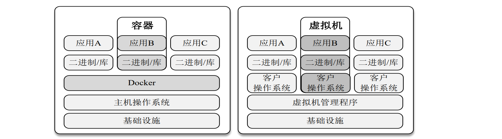
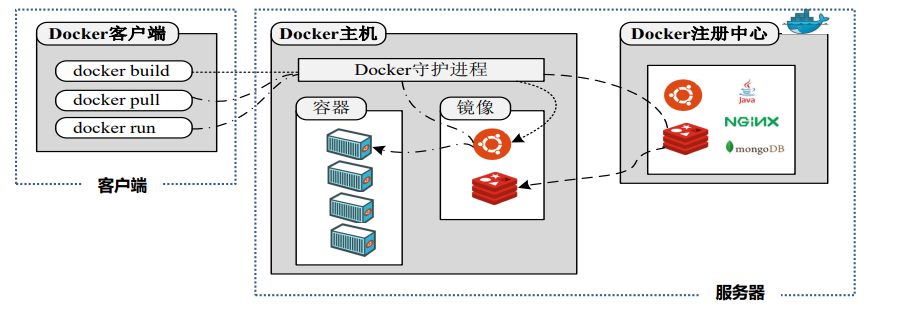
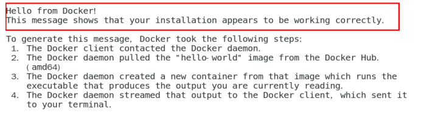
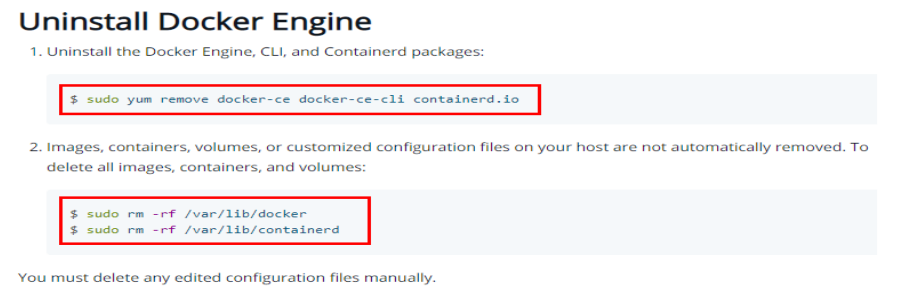
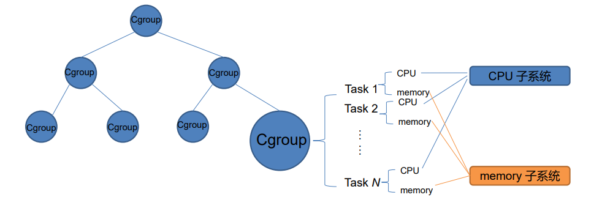
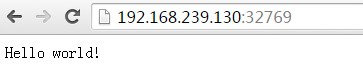

# Docker容器

Docker之所以发展如此迅速，因为它对此给出了一个标准化的解决方案——系统平滑移植，容器虚拟化技术。也就是说，安装的时候，把原始环境一模一样地复制过来。 开发人员利用 Docker 可以消除协作编码时“在我的机器上可正常工作”的问题。

## 概念和特点

- 定义：Docker是基于Go语言实现的云开源项目，它是解决了运行环境和配置问题的软件容器，方便做持续集成并有助于整体发布的容器虚拟化技术

- 描述
  - 一次镜像，处处运行
  - 容器是镜像的运行时实例， 类似于一个轻量级的沙箱子，它可以被启动、开始、停止、删除。
  - Docker利用容器来运行和隔离应用；每个容器都是相互隔离的、保证安全的平台
- 特点
  - 安全可靠：Docker赋予应用的隔离性不仅限于彼此隔离，还独立于底层的基础设施。Docker默认提供最强的 隔离，因此应用出现问题，也只是单个容器的问题，而不会波及到整台主机
  - 系统资源利用率高：Docker 容器几乎可以在任意的平台上运行，包括物理机、虚拟机、公有云、私有云、个人电脑、服 务器等。这种兼容性可以让用户把一个应用程序从一个平台直接迁移到另外一个
  - 标准开放：使用Docker，只需要小小的修改，就可以替代以往大量的更新工作。所有的修改都以增量的方式被 分发和更新，从而实现自动化并且高效的管理。
  - 轻量化
  - 标准开放

- 传统虚拟技术与docker：与传统的虚拟机相比，Docker优势体现在启动速度快，占用体积小
  - 传统虚拟机技术
    - 资源占用多
    - 冗余步骤多
    - 启动慢
    - 虚拟机有自己的操作系统，且独立于主机操作系统，其操作系统内核可以和主机不同
  - docker虚拟化技术
    - Linux容器，具有可移植性和一致性
    - Linux 容器不是模拟一个完整的操作系统而是对进程进行隔离。
    - 容器之间共享主机的操作系统，容器引擎将容器当作进程在主机上运行，其内核使用的是主机操作系统的内核



## 架构

采用C/S模式



- Docker客户端：一般通过Docker command来发起请求
- Docker服务器
- Docker容器
  - 从面向对象角度：容器是用镜像创建的运行实例，就像是Java中的类(镜像)和实例对象(容器)一样
  - 从镜像容器角度：可以把容器看做是一个简易版的 Linux 环境
- Docker镜像：一个只读的模板
- Docker仓库：最大的公开仓库是 Docker Hub

## 安装与使用

前置知识

- Docker依赖于已存在并运行的Linux内核环境：Docker必须部署在Linux内核的系统上。如果其他系统想部署Docker就必须安 装一个虚拟Linux环境。
- Docker安装要求系统为64位、Linux系统内核版本为 3.8以上

以CentOS为例进行安装

1.确定是CentOS7及以上版本：`cat /etc/redhat-release`。结果大概如下：

```
$ cat /etc/redhat-release
CentOS linux release 7.6.1810(Core)
```

2.安装所需的软件包

- 安装gcc：`yum install –y gcc` 和`yum install –y gcc-c++`。
- 安装yum-tuils： `yum install –y yum-utils`

3.获取stable镜像仓库：

- 推荐使用国内镜像：`yum-config-manager --add-repo http://mirrors.aliyun.com/docker-ce/linux/centos/docker-ce.repo;`
- 官方：`yum-config-manager --add-repo http://mirrors.aliyun.com/docker-ce/linux/centos/docker-ce.repo;`

4.更新yum软件包并安装Docker：

- `yum makecache fast;`
- `yum yum update;`
- `yum install –y docker-ce docker-ce-cli containerd.io`

5.启动Docker：`systemctl start docker`

6.测试Docker：

-  `docker version`
-  `docker run hello-world`

输出一下结果说明安装成功



7.删除Docker：

- `systemctl stop docker`
- `yum remove docker-ce docker-ce-cli containerd.io`
- `rm -rf /var/lib/docker`
- `rm -rf /var/lib/containerd`

官方的卸载命令：



## 参数

```
runoob@runoob:~$ docker ps
CONTAINER ID        IMAGE                  COMMAND              ...  
5917eac21c36        ubuntu:15.10           "/bin/sh -c 'while t…"    ...
```

- CONTAINER ID: 容器 ID。
- IMAGE: 使用的镜像。
- COMMAND: 启动容器时运行的命令。
- CREATED: 容器的创建时间。
- STATUS: 容器状态。
  - created（已创建）
  - restarting（重启中）
  - running 或 Up（运行中）
  - removing（迁移中）
  - paused（暂停）
  - exited（停止）
  - dead（死亡）
- PORTS: 容器的端口信息和使用的连接类型（tcp\udp）。
- NAMES: 自动分配的容器名称。

## Cgroup概述

前置知识：为了对进程资源利用进行限制，对进程资源的使用进行追踪

- 定义：Cgroup技术就是把系统中的所有进程组织成一颗一颗独立的树，每棵树都包含系统的所有进程，树的 每个节点是一个进程组，而每棵树又和一个或者多个subsystem关联。树主要用来将进程进行分组，而 subsystem用来对这些组进行操作。

- 功能
  - 资源限制：限制进程使用的资源上限
  - 优先级控制：不同的组可以有不同的优先级
  - 审计：计算 group 的资源使用情况，可以用来计费
  - 控制：挂起一组进程，或者重启一组进程
- 核心概念
  - task：任务，对应于系统中运行的一个实体，一般是指进程
  - subsystem：子系统，具体的资源控制器（resource class 或者 resource controller），控制某个特定的 资源使用。比如 CPU 子系统可以控制 CPU 时间，memory 子系统可以控制内存使用量
  - cgroup：控制组，一组任务和子系统的关联关系，表示对这些任务进行怎样的资源管理策略
  - hierarchy：层级树，一系列 cgroup 组成的树形结构。
- 架构图



- Ubuntu安装Cgroup：`sudo apt-get install -y cgroup-tools`

- 应用：目前有下面这些资源子系统（subsystem）
  - **CPU：限制调度器分配的 CPU 时间**
  - **Memory：限制 cgroup 中任务使用内存的量，并生成任务当前内存的使用情况报告**
  - Block IO（blkio)：限制块设备（磁盘、SSD、USB 等）的 IO 速率
  - CPU Set (cpuset)：限制任务能运行在哪些 CPU 核上
  -  CPU Accounting (cpuacct)：生成 cgroup 中任务使用 CPU 的报告
  -  Devices：允许或者拒绝 cgroup 中任务对设备的访问
  -  Freezer：挂起或者重启 cgroup 中的任务 
  - Network Classifier(net_cls)：为 cgroup 中的报文设置上特定的 classid 标志，这样 tc 等工具就能根据 标记对网络进行配置
  - Network Priority (net_prio)：对每个网络接口设置报文的优先级
  - perf_event：识别任务的 cgroup 成员，可以用来做性能分析

## Namespace概述

- 前置知识

  - Linux的Namespace对系统的全局资源进行了抽象，让Namespace中的进程组可以认为他们拥有隔离 的全局资源

  - 对于Namespace拥有的全局资源进行修改，只有本Namespace中的进程可见，其他 Namespace的进程是无感知的

  - Namespace功能的Container实现的基础。

- 定义：Namespace是对全局系统资源的一种封装隔离。
- API
  - clone：创建新进程并设置它的namespace
  - setns：让进程加入已经存在 namespace
  - unshare：让进程加入新的 namespace
    - unshare 和 setns 的区别是，setns 只能让进程加入到已经存在的 namespace 中，而 unshare 则让 进程离开当前的 namespace，加入到新建的 namespace 中。
    - unshare 和 clone 的区别在于：unshare 是把当前进程进入到新的 namespace；clone 是创建新的进程， 然后让新创建的进程（子进程）加入到新的 namespace。

- Namespace与control group区别
  - Control group： 又称为控制组，它主要是做资源控制。原理是将一组进程放在放在一个控制组里，通过给 这个控制组分配指定的可用资源，达到控制这一组进程可用资源的目的。
  - Namespace： 又称为命名空间，它主要做访问隔离。其原理是针对一类资源进行抽象，并将其封装在一起 提供给一个容器使用，对于这类资源，因为每个容器都有自己的抽象，而他们彼此之间是不可 见的，所以就可以做到访问隔离。

## 指令

- 拉取镜像：`Docker pull + 镜像名称`，比如：`docker pull centos`
- 新建+启动容器：`docker run [OPTIONS] IMAGE [COMMAND] [ARG...]`
  - -i: 交互式操作。
  - -t: 终端。
  - ubuntu: ubuntu 镜像。
  - /bin/bash：放在镜像名后的是命令，这里我们希望有个交互式 Shell，因此用的是 /bin/bash。

- 后台运行，-d参数：`docker run -itd --name xxxx yyyy/bin/bash`
- 退出容器：`exit` (退出后，容器会停止) 或者 `ctrl + p + q`（退出后，容器不停止）
- 启动已经停止运行的容器： `docker start 容器ID/容器名称`
- 重启容器： `docker restart 容器ID/容器名称`
- 停止容器：`docker stop 容器ID 或者 容器名称`
- 强制停止容器：`docker kill 容器ID/容器名称`
- 删除已停止的容器： `docker rm 容器ID/容器名称` 
- 一次删除多个容器实例： `docker rm -f $(docker ps -a -q)` 或者 `docker ps -a -q | xargs docker rm -f`
- 查看端口映射配置信息：`docker port 容器名/容器ID`
- 查看正在运行的容器： `docker ps` 或者 `docker ps -a`

- 查看容器内某个端口号映射到哪：`docker port 容器名/容器ID 容器端口号`


- 启动守护式容器：
  - 后台守护式启动：`docker run -d 容器名:tag`
  - 前台交互式启动：`docker run -it 容器名:tag`。it: 在新容器内指定一个伪终端或终端。-i: 允许你对容器内的标准输入 (STDIN) 进行交互。
- 查看容器日志：`docker logs 容器ID`
- 查看容器内部细节：`docker insepct 容器ID`
- 进入正在运行的容器并以命令行交互：
  - `docker exec –it 容器ID` （exec 是在容器中打开新的终端，并且可以启动新的进程用exit退出，不会导致容器的停止。【推荐】）
  - `docker attach 容器ID` （attach 直接进入容器启动命令的终端，不会启动新的进程用exit退出，会导致容器的停止。）
- 从容器内重要文件（container.txt）拷贝到主机上：`docker cp 容器ID:容器内路径 目的主机路径`
- 导入容器：`export` 导出容器的内容留作为一个tar归档文件[对应import命令]，导出本地某个容器

  - 例子，导出容器 1e560fca3906 快照到本地文件 ubuntu.tar。：`docker export 1e560fca3906 > ubuntu.tar`

- 导出容器：`import` 从tar包中的内容创建一个新的文件系统再导入为镜像[对应export]

  - 可以使用 docker import 从容器快照文件中再导入为镜像，以下实例将快照文件 ubuntu.tar 导入到镜像 test/ubuntu:v1: `cat docker/ubuntu.tar | docker import - test/ubuntu:v1`


## 实验：运行一个 web 应用

1.我们将在docker容器中运行一个 Python Flask 应用来运行一个web应用。

```
runoob@runoob:~# docker pull training/webapp  # 载入镜像
runoob@runoob:~# docker run -d -P training/webapp python app.py
```


参数说明:

- **-d:**让容器在后台运行。
- **-P:**将容器内部使用的网络端口随机映射到我们使用的主机上。

2.使用 docker ps 来查看我们正在运行的容器：这里多了端口信息。

```
runoob@runoob:~#  docker ps
CONTAINER ID        IMAGE               COMMAND             ...        PORTS                 
d3d5e39ed9d3        training/webapp     "python app.py"     ...        0.0.0.0:32769->5000/tcp
```

Docker 开放了 5000 端口（默认 Python Flask 端口）映射到主机端口 32769 上。这时我们可以通过浏览器访问WEB应用



3.我们也可以通过 -p 参数来设置不一样的端口：

```
runoob@runoob:~$ docker run -d -p 5000:5000 training/webapp python app.py
```

4.docker ps查看正在运行的容器

```
runoob@runoob:~#  docker ps
CONTAINER ID        IMAGE                             PORTS                     NAMES
bf08b7f2cd89        training/webapp     ...        0.0.0.0:5000->5000/tcp    wizardly_chandrasekhar
d3d5e39ed9d3        training/webapp     ...        0.0.0.0:32769->5000/tcp   xenodochial_hoov
```

容器内部的 5000 端口映射到我们本地主机的 5000 端口上。
