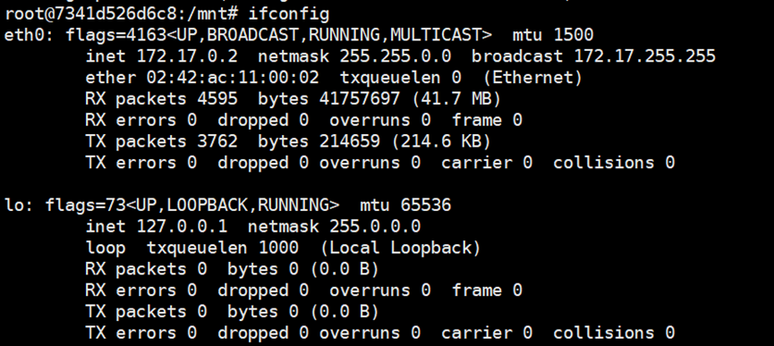

# Docker镜像

## 概述

- 描述
  - 镜像是一种轻量级、可执行的独立软件包
  - Docker镜像层都是只读的，容器层是可写的
  - 把应用程序和配置依赖打包好形成一个可交付的运行环境，这个打包好的运行环境就 是image镜像文件

- 结构：`Remote-dockerhub.com/namespace/bar:latest`为例
  - Remote docker hub：集中存储镜像的Web服务器地址。
  - Namespace：类似于Github中的命名空间，是一个用户或组织中所有镜像的集合。
  - Repository：类似于Git仓库
  - Tag：类似于Git仓库中的tag，一般用来区分同一类镜像的不同版本。
  - Layer：镜像由一系列层组成，每层都用64位的十六进制数表示，非常类似于Git仓库中的 commit。
  - Image ID：镜像最上层的layer ID就是该镜像的ID
  - Repo：tag提供了易于人类识别的名 字，而ID便于脚本处理、操作镜像


- 镜像架构
  - 当容器启动时，一个新的可写层被加载到镜像的顶部。这一层通常被称作“容器层”，“容器层”之下的都叫“镜像层”
  - 所有对容器的改动都只会发生在容器层中。只有容器层是可写的，容器层下面的所有镜像层都是只读的


- 镜像仓库架构


- UnionFS(联合文件系统)：
  - 定义：一种分层、轻量级并且高性能的文件系统，它支持对文件系统的修改作为一次提交来一层层的叠加，是 Docker 镜像的基础
  - 特性：花卷，一层一层的
    - 一次同时加载多个文件系统，但从外面看起来，只能看到一个文件系统，联合加载 会把各层文件系统叠加起来，这样最终的文件系统会包含所有底层的文件和目录。
    - 镜像由多个层组成，每层叠加之后，从外部看来就如一个独立的对象。

- 标识
  - 镜像ID
    - 镜像ID是镜像的唯一标识，采用UUID的形式表示。
    - 实际上镜像ID取自镜像基于sha256哈希算法的摘要值。
    - 在镜像操作过程中，通常采用前12个字符的缩略形式。
  - 在镜像操作过程中，通常采用前12个字符的缩略形式。
    - 在镜像操作过程中，通常采用前12个字符的缩略形式。
    - 实际上完整的镜像名称包括Docker注册中心。
  - 镜像的摘要值
    - 镜像可以使用IMAGE[@DIGEST] 格式标识，其中IMAGE表示镜像仓库名称。

## 镜像指令

- 查看镜像：`docker images`
- 查看使用方法：`images --help`

- 从Dockerfile构建镜像：`docker image build`
- 查看镜像的历史记录：`docker images history`
- 输出镜像列表：`docker image ls`
- 拉取镜像：`docker image pull`
- 推送镜像：`docker image push`
- 删除镜像：`docker image rm`
- 为指向源镜像的目标镜像添加一个名称：`docker image tag`

## 镜像使用

同一个仓库中的镜像并不一定要有特别的关系，比如 ubuntu：14.04和ubuntu：14.04.2之间就没有共享任何层。


- 获取镜像
  - 直接下载镜像(以busybox为例)：`docker pull busybox`
  - 导入镜像：`docker save -o busy.tar busybox`、`docker load -i busybox.tar`

- 制作镜像
  - 将一个镜像导出为根文件系统的归档：`docker export`
  - 导入包含根文件系统的归档，并将之变成Docker镜像：`docker import -镜像用户/镜像名:镜像版本号`
  - 增量地生成一个镜像：`docker commit -m="提交的描述信息" -a="作者" 容器ID 要创 建的目标镜像名:[标签名]`
- 查找镜像：`docker search xxxx`
  - NAME: 镜像仓库源的名称
  - DESCRIPTION: 镜像的描述
  - OFFICIAL: 是否 docker 官方发布
  - stars: 类似 Github 里面的 star，表示点赞、喜欢的意思。
  - AUTOMATED: 自动构建。

- 架构图


- 启动容器：`docker run [OPTIONS] IMAGE  [COMMAND] [ARG...]`
  - --name="容器新名字"：为容器指定一个名称；
  - -d：后台运行容器并返回容器ID，也即启动守护式容器(后台运行)；
  -  -i：以交互模式运行容器，通常与 -t 同时使用；
  - -t：为容器重新分配一个伪输入终端，通常与 -i 同时使用； 也即启动交互式容器(前台有伪终端，等待交互)；
  - -P: 随机端口映射，大写P
  - -p: 指定端口映射，小写p

## 实验1：镜像安装

- 要求	

  - 成功安装ubuntu，在安装好的ubuntu系统中，

  - 实现特定vim编辑功能，网络查询功能

0.安装软件：如图


1.1 搜索镜像：`docker search ubuntu`


1.2 拉取镜像：`docker pull ubuntu`


1.3 查看镜像：`docker images`


1.4 基于镜像启动容器: `docker run -it xxxxxx /bin/bash`


1.5 停止容器: `docker stop xxxx`


2.1安装vim

`apt-get update`


`apt-get install vim`


successfully


2.2 安装网络查询功能

`apt-get install net-tools`


successfully



## 实验2：Dockerfile与镜像构建

- 创建镜像架构图


- 定义：Dockerfile是用来构建Docker镜像的文本文件，是由一条条构建镜像所需的指令和参数 构成的脚本。

- Dockerfile结构
  - 基础镜像信息
  - 维护者信息
  - 镜像操作指令
  - 容器启动时指令

- 参数
  - `FROM < image>`：指定基础镜像，必须为第一个命令，定制的镜像都是基于 FROM 的镜像
  - `MAINTAINER < name>`：维护者信息。
  - `RUN < command>`：构建镜像时执行的命令
  - CMD：类似于 RUN 指令，用于运行程序，但二者运行的时间点不同。CMD 在docker run 时运行， 用于指定在容器启动时所要执行的命令，RUN 是在docker build时运行，用于指定镜像构建时 所要执行的命令。
  - `COPY < src> < dest>`：复制指令，从上下文目录中复制文件或者目录到容器里指定路径
  - `ENV < key> < value>`：设置环境变量，定义了环境变量，那么在后续的指令中，就可以使用这个环境变量
  - VOLUME： 将主机上的某个目录与容器的某个目录（称为挂载点、或者叫卷）关联起来，容器上的挂 载点下的内容就是主机的这个目录下的内容。

构建一个镜像

1.Dockerfile文件内容：`vim Dockerfile`

```
#基础镜像
FROM centos:7
#维护者
MAINTAINER 490358423@qq.com 
# 初始化路径
ENV MYPATH /usr/local 
WORKDIR $MYPATH
#安装vim编辑器 
RUN yum -y install vim 
#安装ifconfig命令查看网络IP 
RUN yum -y install net-tools
EXPOSE 80
CMD echo $MYPATH
CMD echo "install inconfig cmd into ubuntu success--------------ok"
CMD /bin/bash
```

2.构建：`docker build -t centosvimnettool:2.0`


3.运行：`docker run -it centosvimnettool:2.0 /bin/bash`


