# Docker镜像仓库

## 概述

- 公共仓库：docker的指令默认是与DOcker Hub进行操作
  - 最经典的公共仓库就是 Docker Hub（https://hub.docker.com）
  - 阿里云（ https://www.aliyun.com/）
  - Quay（https://github.com/quay/quay）

- 描述：仓库的名字通常由两部分组成，中间以斜线分开。斜线之前是用户名，斜线之后是镜像 名。如`tom/ubuntu`表示属于用户tom的Ubuntu镜像

- 登录：`docker login -u < user name> -p < password> -e <email> < registry domain>`

## 镜像仓库服务

- `docker push xxx`
- `docker pull xxx`

- 镜像下载：上传时是先上传镜像Manifest，后上传layers
- 镜像上传：上传时是先上传镜像layers，后上传Manifest

## 私有仓库

搭建私有仓库的前提是部署Docker Private Registry

- Registry的运行命令格式：`docker run -d -p 5000:5000 -v  /wolf/dockerCourse/myfile/myregistry/:/tmp/registry --privileged=true registry；`。默认情况，仓库被创建在容器的/var/lib/registry目录下，建议自行用容器卷映射，方便于宿 主机联调

- 构建反向代理：在实际应用中，暴露主机端口的方法是不安全的，如果Registry没有配置访问代理， 任何用户都是可以直接通过端口访问的。因此，设计时需要为其加上HTTPS反向代理。**请求经过代理服务的方式保证了对内部服务器的安全访问**。

## 设置国内镜像仓库

- [Docker](https://so.csdn.net/so/search?q=Docker&spm=1001.2101.3001.7020)中国区官方镜像https://registry.docker-cn.com
- 网易：http://hub-mirror.c.163.com
- ustc ：https://docker.mirrors.ustc.edu.cn
- 中国科技大学：https://docker.mirrors.ustc.edu.cn
- 阿里云容器 生成自己的加速地址：https://www.aliyun.com/?spm=5176.12901015-2.0.0.1129525cKYlRVE

设置过程

1.创建或修改 /etc/docker/daemon.json 文件，修改为如下形式

```json
{
    "registry-mirrors": [
        "http://hub-mirror.c.163.com",
        "https://docker.mirrors.ustc.edu.cn",
        "https://registry.docker-cn.com"
    ]
}
```

2.加载重启docker：`service docker restart`

3.查看是否成功：`docker info`

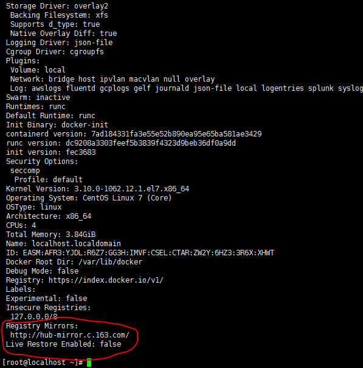

## 实验1：将镜像发布到dockerhub

- dockerhub地址：https://hub.docker.com/signup

1.登录：`docker login -u`

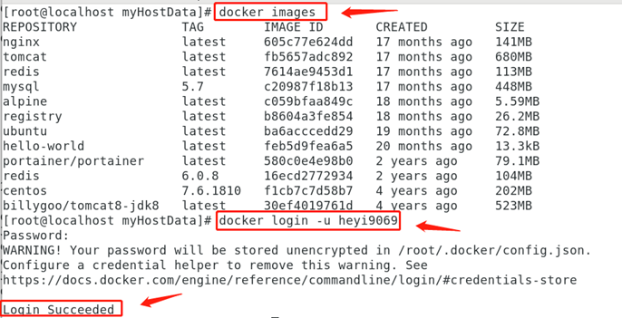

2.打标签【记住带上自己的版本号，修改容器版本号命令行：`docker tag 镜像ID` 或者 `容器ID Dockerhub账号/镜像名称或者容器名称:版本号`】

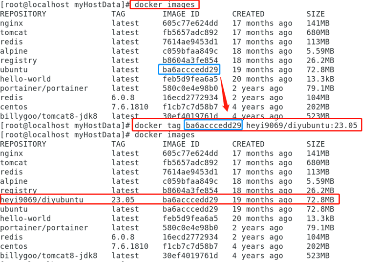

3.提交镜像：`docker push dockerhub账号/镜像名称或者容器名称:版本号`

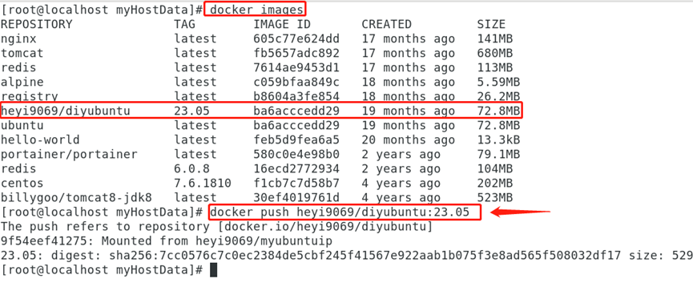

4.下载自己的镜像，并建立容器，测试其功能

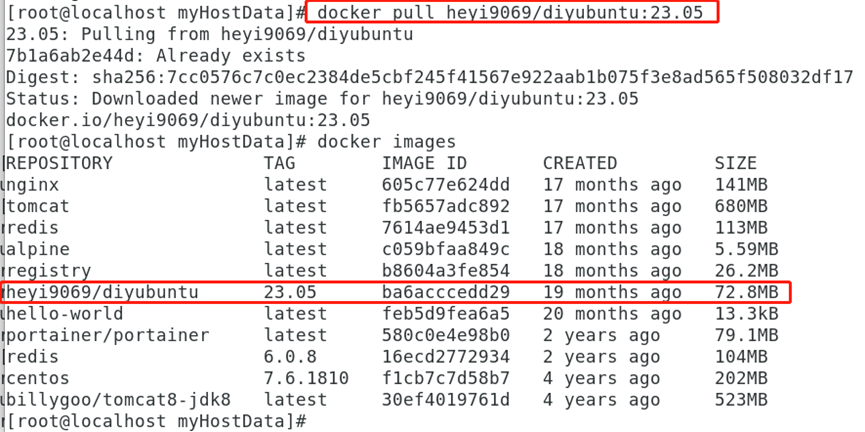

## 实验2：将镜像发布到阿里云

- 网址：https://promotion.aliyun.com/ntms/act/kubernetes.html

1.找到容器镜像服务

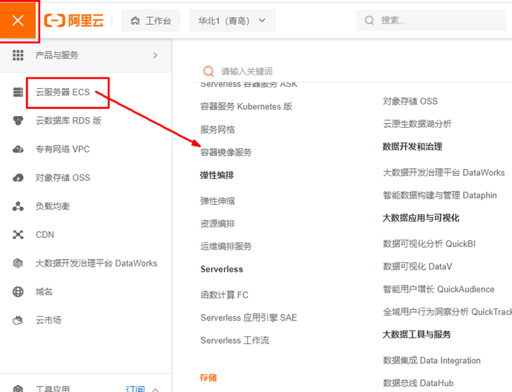

2.找到个人实例

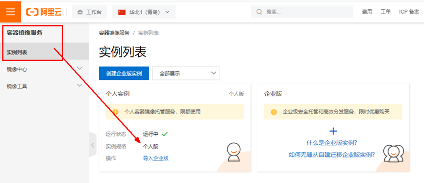

3.创建命名空间

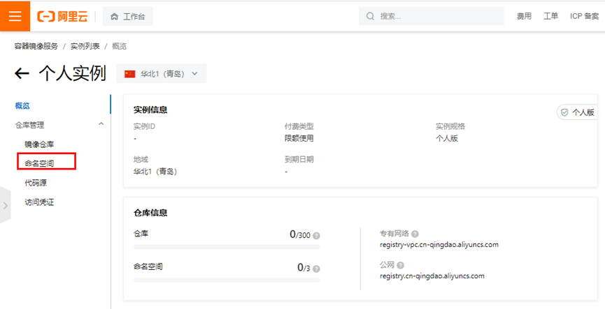

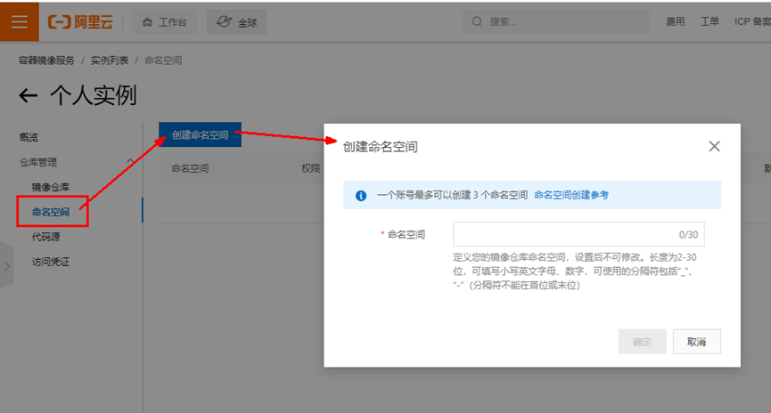

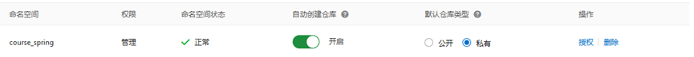

4.创建容器仓库【请选择“本地仓库”】

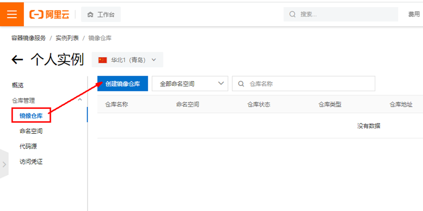

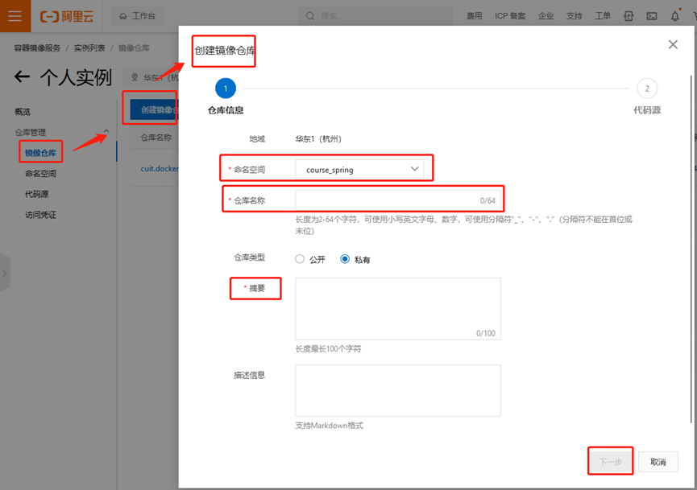

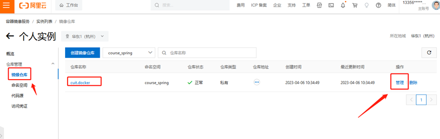

5.浏览阿里云操作步骤【请记得退出当前账号：`docker logout`】

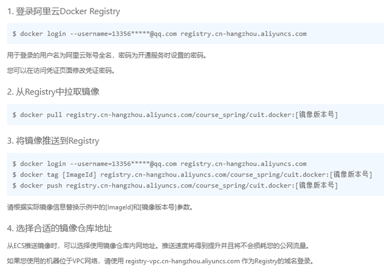

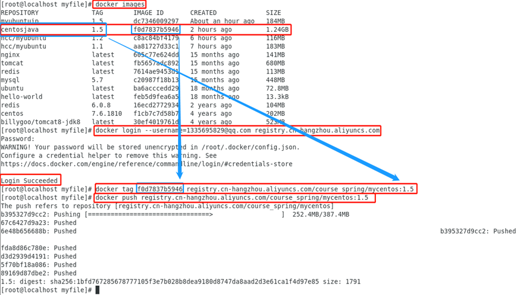

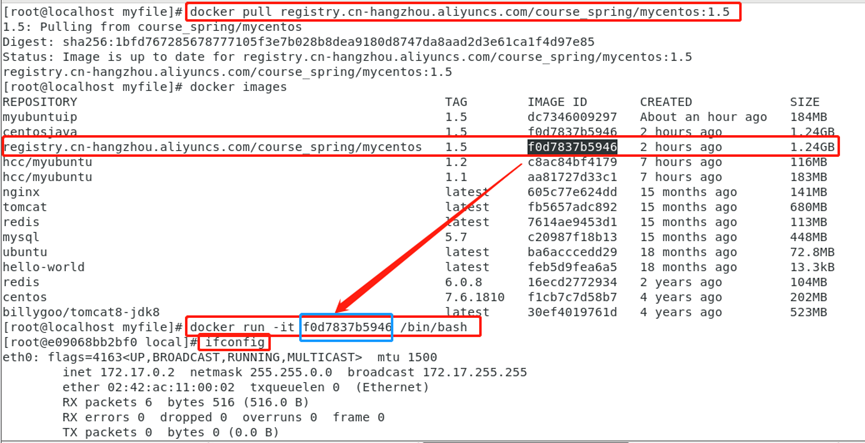

6.拉取已上传镜像，并建立容器，测试

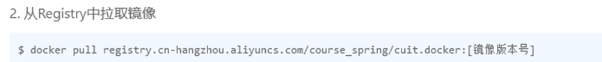

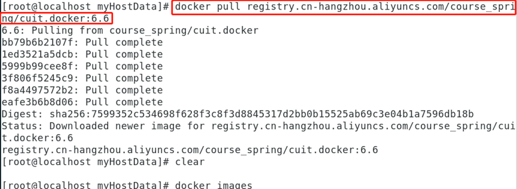

