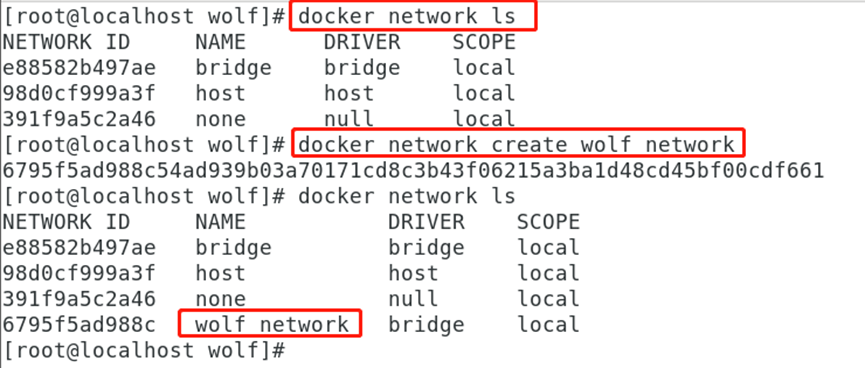
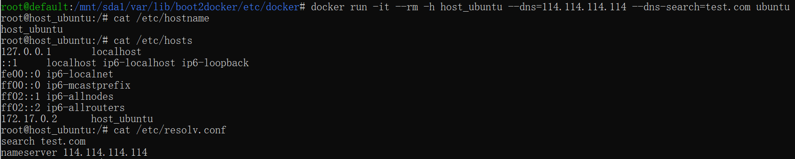

# Docker网络

## 基础

Libnetwork提出了新的容器网络模型（Container Network Model，简称CNM），定义了标准的API用于为容器配置网络，其底层可以适配各种网络驱动

每创建一个网络，Docker会在主机上创建一个单独的沙盒，沙盒的实现实质上是一个 Network Namespace

- CNM模型高层架构
  - 沙盒：一个沙盒可以包括来自多个 网络的多个Endpoint（端点）
  - Endpoint：Endpoint的实现可以是一对veth pair或 者OVS内部端口，当前的Libnetwork使用的是veth pair
  - 网络：包括一组能互相通信的Endpoint

- 目前，Libnetwork已经实现了以下5种驱动

  - none：不为容器配置任何网络功能

  - container：与另一个运行中的容器共享Network Namespace，共享相同的网络视图。实质上两个容器是共享同 一个Network Namespace的，自然网络 配置也是完全相同的。

  - host：与主机共享Root Network Namespace，容器有完整的权限可以操纵主机的协议栈、路由表和防火墙等，所以被认为是不安全的。

  - bridge：Docker设计的NAT网络模型。

    

  - overlay：Docker原生的跨主机多子网模型。

    

- 网络作用域
  - local作用域：仅在Docker主机范围内提供连接和网络服务（如DNS和IPAM）
  - swarm作用域：提供跨Swarm集群的连接和网络服务。

## 指令

- 展示网络列表：`docker network ls`
- 将容器连接到指定的网络：`docker network connect`
- 创建一个网络：`docker network create`
- 断开容器与指定网络的连接：`docker network disconnect`
- 显示一个或多个网络的详细信息：`docker network inspect`
- 显示网络列表：`docker network ls`
- 删除所有未使用的网络：`docker network prune`
- 删除一个或多个网络：`docker network rm`
- 查看网络数据源：`docker network inspect XXX网络名字`

## 配置容器的网络连接

- 使用默认桥接网络

  - 桥接网络通过软件网桥让连接到同一桥接网络的容器之间可以相互通信，同时隔离那些没有连接到该桥接网络的容器。

  - bridge是Docker的默认网络模式。

  - Docker采用NAT(网络地址转换)方式将容器内部服务监听的端口与主机的某一个端 口进行绑定


- 使用主机网络

  - 与bridge模式不同，host模式没有为容器创建一个隔离的网络环境

  - 容器没有隔离的网络名称空 间，不会获得一个独立的网络名称空间，而是和Docker主机共用一个网络名称空间


- 使用none网络模式
  - 使用none模式，Docker容器拥有自 己的网络名称空间，但是并不会为 Docker容器进行任何网络配置，构 造任何网络环境。
  - 使用none模式，Docker容器拥有自 己的网络名称空间，但是并不会为 Docker容器进行任何网络配置，构 造任何网络环境。
  - 这种模式关闭了容器的网络功能。有些容器并不需要网络，如只需要写磁盘卷的批处理任务。


- 使用container网络模式
  - 采用此模式的Docker容器会共享其他容器的网络环境。
  - 这种网络模式主要用于容器和容器之间频繁交流的情况


- 用户自定义桥接网络
  - --network选项的使用。alpine3容器仅连接到默认桥接网络bridge。
  - 使用`docker network inspect`命令分别查看bridge网络和alpine-net网络的详细信息

## 容器与外部的网络通信

非重点

- 容器访问外部网络

  - 启用容器到外部的访问，涉及两个设置
    - 配置Linux内核以允许IP转发
    - 确认iptables默认的FORWARD策略设置为“ACCEPT”

  - 通过NAT实现容器到外部的访问

- 从外部网络访问容器

  - 使用选项-p发布特定端口

  - 验证端口映射的NAT过程
  - 查看端口映射配置
  - 使用选项-P发布所有暴露的端口
  - 限制外部网络访问

## 容器之间的网络通信

非重点

- 以传统方式建立容器连接
  - 容器的名称信息
  - 通过容器连接进行通信
  - 环境变量
  - 更新/etc/hosts文件

## 5种网络驱动

### Bridge模式


### none模式

1.进入容器内部查看


2.在容器外部查看


### container模式


`docker run -it --name alpine1 alpine /bin/sh`


`docker run -it --network container:alpine1 --name alpine2 alpine /bin/sh`


假如此时关闭alpine1，再看看alpine2


### Host模式


`docker run -d --network host --name tomcat83 billygoo/tomcat8-jdk8`


### 自定义网络

1.自定义网络前，启动两个容器(名称：tomcat81和tomcat82)：

- `docker run -d -p 8081:8080  --name tomcat81 billygoo/tomcat8-jdk8` 和 `docker run -d -p 8082:8080  --name tomcat82 billygoo/tomcat8-jdk8`
- 进入tomcat81容器并查询IP地址


- 进入tomcat82容器并通过IP地址与tomcat81通信【命令行：ping 172.17.0.2】


-  进入容器tomcat82，通过服务名称地址与tomcat81通信


- 进入容器tomcat81，通过服务名称地址与tomcat82通信


2.自定义网络后

- 通过命令自定义网络



- 新建容器加入上一步新建的自定义网络：`docker run -d -p 8081:8080 --network wolf_network --name tomcat81 billygoo/tomcat8-jdk8` 和 `docker run -d -p 8082:8080 --network wolf_network --name tomcat82 billygoo/tomcat8-jdk8`

- 进入容器tomcat81，通过服务名称地址与tomcat82通信


- 进入容器tomcat82，通过服务名称地址与tomcat81通信


## 实验1：网络连接


1.自定义创建网络，并用确认：`docker network create mynet`


2.在自定义网络下，启动两个容器

- `docker run -d -P --name tomcat-net-01 --net mynet billygoo/tomcat8-jdk8`

- `docker run -d -P --name tomcat-net-02 --net mynet billygoo/tomcat8-jdk8`


3.在docker0网络下，启动了两个容器，并用确认

- `docker run -d -P --name tomcat01 billygoo/tomcat8-jdk8`

- `docker run -d -P --name tomcat02 billygoo/tomcat8-jdk8`


4.查看当前容器


5.用docker network connect 进行打通

-  `docker network connect mynet tomcat01`  


- `docker network inspect mynet | tail -n 25`


6.测试

- `docker exec -it tomcat01 ping tomcat-net-01`


7.思考

- tomcat01 能ping通tomcat-net-02 吗？可以
- tomcat02 能ping通吗？不可以

## 实验2：配置DNS

1.我们可以在宿主机的 `/etc/docker/daemon.json` 文件中增加以下内容来设置全部容器的 DNS：

```json
{
  "dns" : [
    "114.114.114.114",
    "8.8.8.8"
  ]
}
```

设置后，启动容器的 DNS 会自动配置为 114.114.114.114 和 8.8.8.8。配置完，需要重启 docker 才能生效。

2.查看容器的 DNS 是否生效可以使用以下命令，它会输出容器的 DNS 信息：

```
$ docker run -it --rm  ubuntu  cat etc/resolv.conf
```


3.手动指定容器的配置。如果只想在指定的容器设置 DNS，则可以使用以下命令：

```
$ docker run -it --rm -h host_ubuntu  --dns=114.114.114.114 --dns-search=test.com ubuntu
```

参数说明：

- --rm：容器退出时自动清理容器内部的文件系统。
- -h HOSTNAME 或者 --hostname=HOSTNAME： 设定容器的主机名，它会被写到容器内的 /etc/hostname 和 /etc/hosts。
- --dns=IP_ADDRESS： 添加 DNS 服务器到容器的 /etc/resolv.conf 中，让容器用这个服务器来解析所有不在 /etc/hosts 中的主机名。
- --dns-search=DOMAIN： 设定容器的搜索域，当设定搜索域为 .example.com 时，在搜索一个名为 host 的主机时，DNS 不仅搜索 host，还会搜索 host.example.com。



如果在容器启动时没有指定 --dns 和 --dns-search，Docker 会默认用宿主主机上的 /etc/resolv.conf 来配置容器的 DNS。

