# 容器卷管理

## 概述

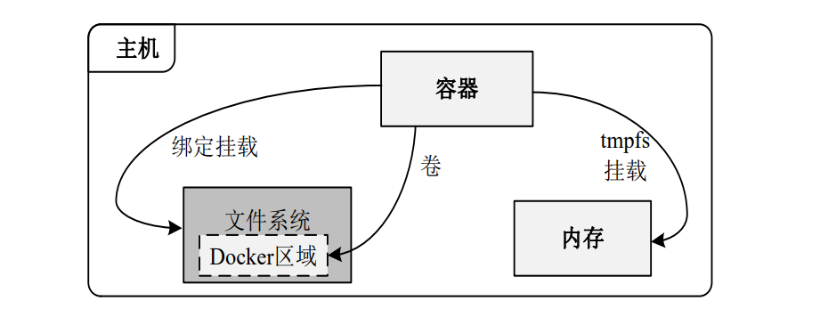

- 一些概念

  - Docker存储驱动与联合文件系统：联合文件系统（UnionFS）是一种为Linux、FreeBSD和NetBSD操作系统设计的， 将其他文件系统合并到一个联合挂载点的文件系统

  - OverlayFS的镜像分层与共享：overlay2存储驱动与overlay存储驱动最本质的区别是镜像层之间共享数据的方法不同，overlay2存储驱动通过每层的lower文件，而overlay存储驱动通过硬链接

  - tmpfs挂载：在不需要将数据持久保存到主机或容器中时，tmpfs挂载最合适

- 具名挂载：`docker run -it --privileged=true -v /wolf/dockerCourse/myfile/myHostData:/tmp/myDockerData --name u1 ubuntu`
- 匿名挂载：`docker run -it --privileged=true -v /tmp/myDockerData --name u1 ubuntu`

## 绑定挂载

- 使用
  - 创建卷：`docker volume create my-vol`
  - 列出当前的卷（列出卷驱动和卷名称）：`docker volume ls`
  - 查看卷的详细信息：`docker volume inspect my-vol`
  - 删除卷：`docker volume rm [OPTIONS] VOLUME [VOLUME...]`

- 绑定挂载实例1：将主机上现有目录/home/html挂载到容器中的/usr/share/nginx/html目录
  1. 使用--mount选项时要指明挂载类型：`docker run -d --name nginxtest1 --mount`
  2. 改用-v选项：`docker run -d --name nginxtest1 -v /home/html:/usr/share/nginx/html`
- 绑定挂载实例2：将/etc/localtime文字 挂载到容器：`docker run --rm -it -v /etc/localtime:/etc/localtime ubuntu /bin/bash`

## tmpfs挂载

- tmpfs挂载是临时性的，仅存储在主机的内存中，如果内存不足，则使用交换分区。当容器停止时，tmpfs挂载会被移除，写入的文件也不会保存下来。

- 示例：在nginx容器中的/app目录创建一个tmpfs挂载：`docker run -d -it --name tmptest --tmpfs /app nginx:latest`

## 实验1：宿主vs容器之间映射添加容器卷

1.创建一个容器

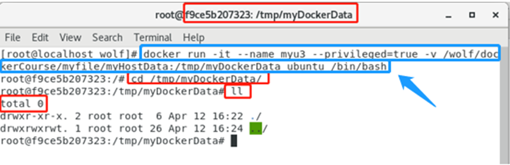

2.查询卷挂载的情况：`docker inspect 容器ID`

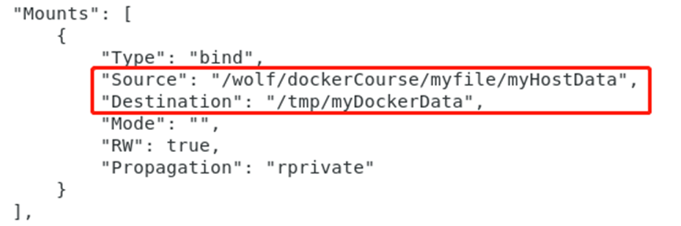

3.容器文件路径：`/tmp/myDockerData`

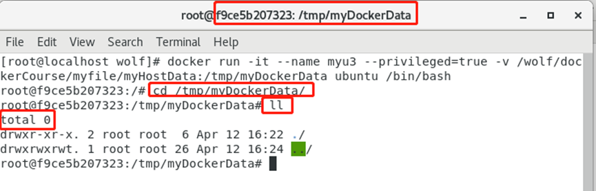

4.宿主机目录：`/wolf/dockerCourse/myfile/myHostData`

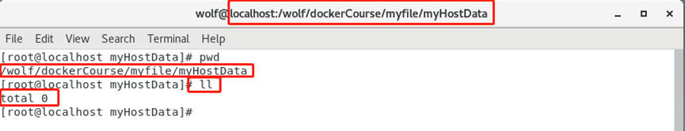

5.在容器内写数据：`echo 'docker update 123'>>a.log`

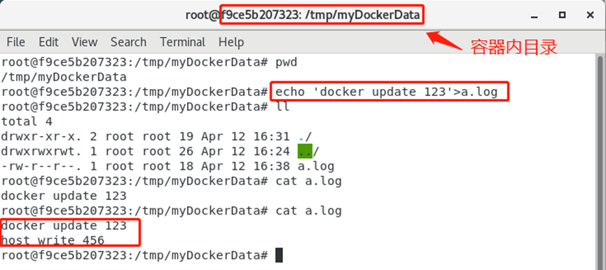

6.在主机目录内写数据：`echo 'Host write 456'>>a.log`

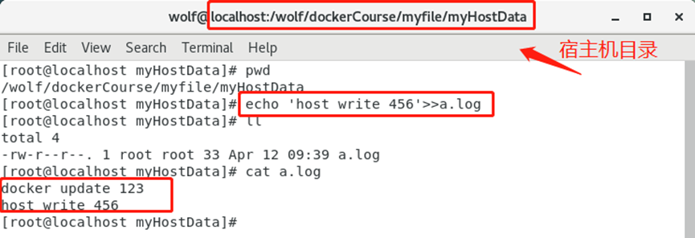

## 实验2：读写规则映射添加说明

默认读写模式：`docker run -it --name myu3 --privileged=true -v /wolf/dockerCourse/myfile/myHostData:/tmp/myDockerData:rw ubuntu /bin/bash`

- 容器目录

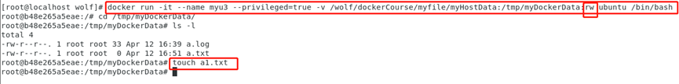

- 主机目录	

只读模式：`docker run -it --name myu3 --privileged=true -v /wolf/dockerCourse/myfile/myHostData:/tmp/myDockerData:ro ubuntu /bin/bash`

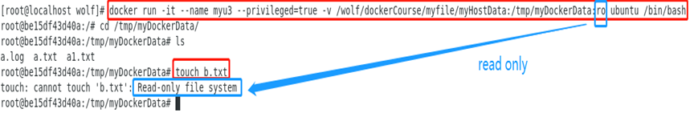

## 实验3：卷的继承和共享

1.容器1完成和宿主机的映射：`docker run -it --privileged=true -v /wolf/dockerCourse/myfile/myHostData:/tmp/myDockerData --name u1 ubuntu`

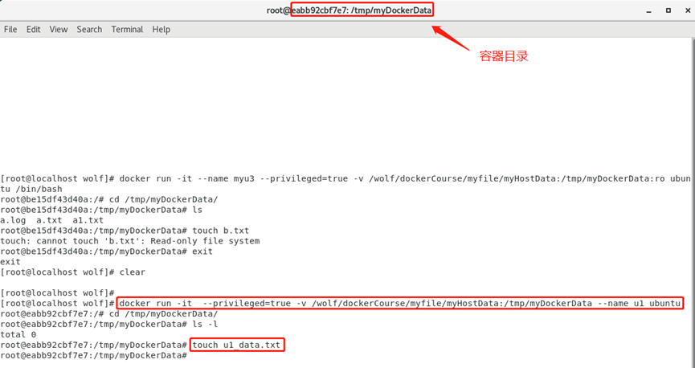

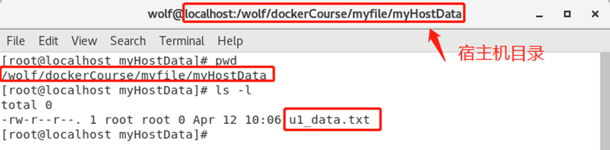

2.容器2继承容器1的卷规则：`docker run -it --privileged=true --volumes-from u1 --name u2 ubuntu`

- 在容器u2中，`/tmp/myDockerData`目录下写下u2_data.txt

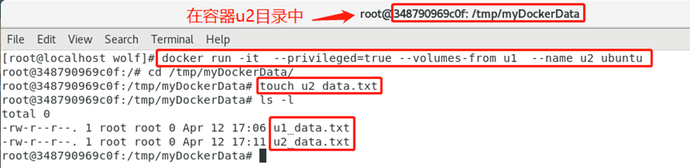

- 在主机中，查询/tmp/myDockerData目录下的内容

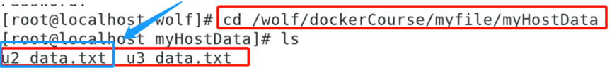

3.容器3继承容器1的卷规则：`docker run -it --privileged=true --volumes-from u1 --name u3 ubuntu`

- 查询容器

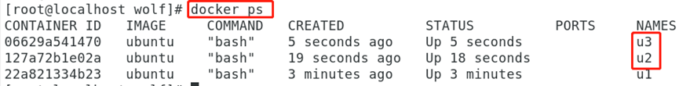

- 在容器u3中，`/tmp/myDockerData`目录下写下u3_data.txt**

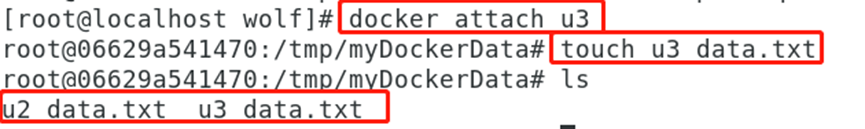

- 在容器u1中，查询`/tmp/myDockerData`目录下的内容

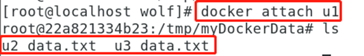

- 在主机中，查询`/tmp/myDockerData`目录下的内容

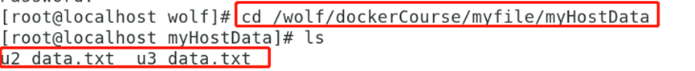

4.思考

- 删除容器1并且容器2更新文件后，容器3还能访问卷数据吗？能
- 删除容器1和容器2后，容器3还能访问卷数据吗？能
- 容器3继承容器2，容器2继承容器1的卷，那么，删除容器2时，容器3还能访问卷数据吗？能

## 实验4：portainer安装nginx

1.网站：https://www.portainer.io/

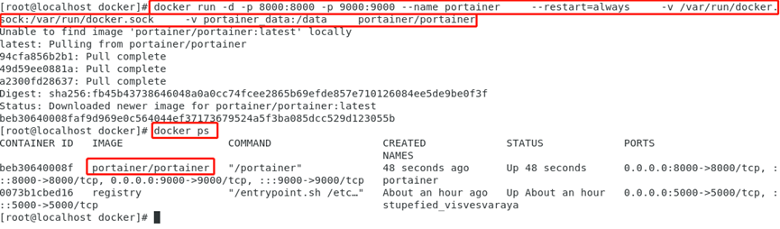

2.第一次登录需创建admin，访问地址：xxx.xxx.xxx.xxx:9000

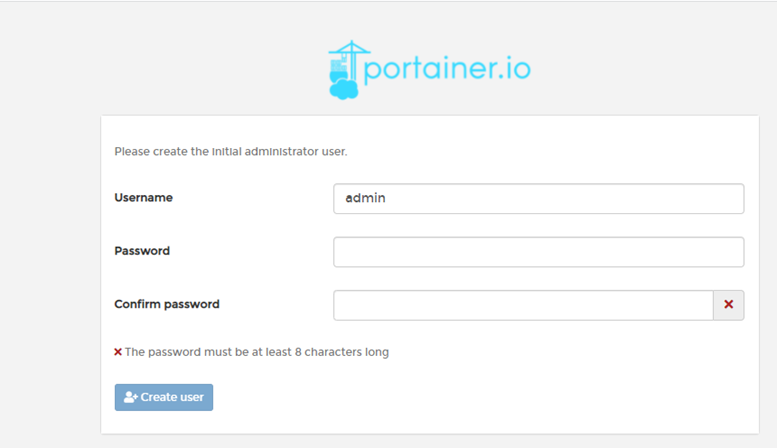

3.设置admin用户和密码后首次登陆

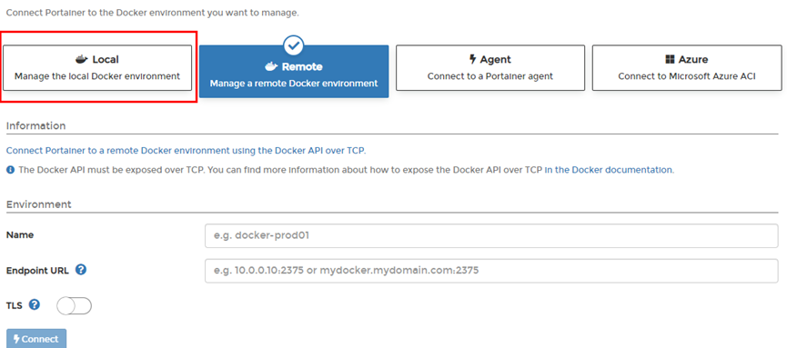

4. 选择local选项卡后本地docker详细信息展示

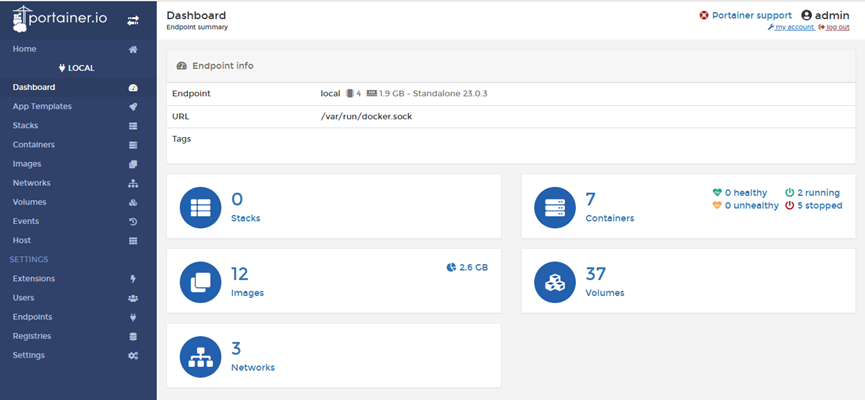

5.上一步的图形展示，能想得起对应命令吗？

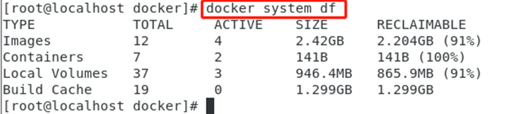

6.设置

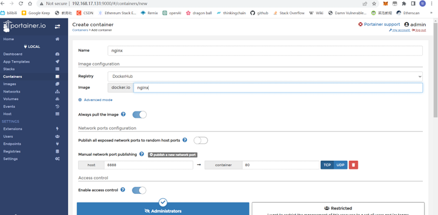

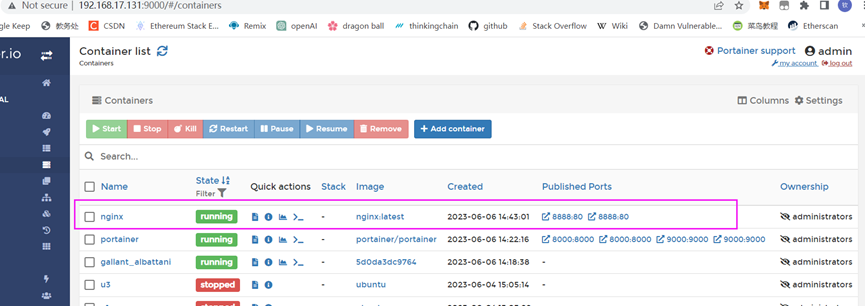

7.成功

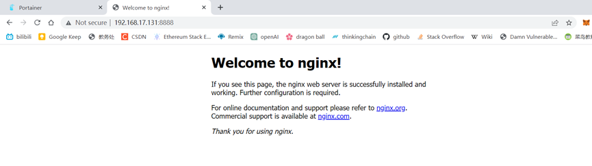
