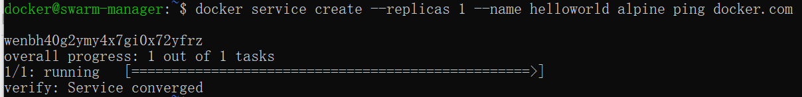
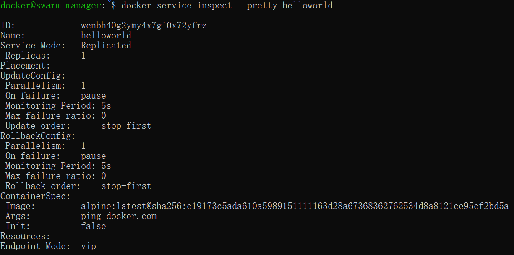
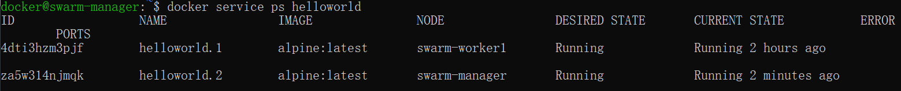
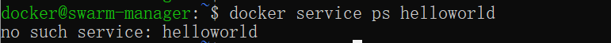

## Docker 集群

## 概述

- 定义
  - Docker Swarm 是 Docker 的集群管理工具，它将 Docker 主机池转变为单个虚拟 Docker 主机。
  - Docker Swarm 提供了标准的 Docker API，所有任何已经与 Docker 守护程序通信的工具都可以使用 Swarm 轻松地扩展到多个主机。
  - 支持的工具包括但不限于以下各项：Dokku，Docker Compose，Docker Machine，Jenkins

- 原理：swarm 集群由管理节点（manager）和工作节点（work node）构成。
  - swarm mananger：负责整个集群的管理工作包括集群配置、服务管理等所有跟集群有关的工作。
  - work node：即图中的 available node，主要负责运行相应的服务来执行任务（task）。


## 使用

以下示例，均以 Docker Machine 和 virtualbox 进行介绍，确保你的主机已安装 virtualbox。

1.创建 swarm 集群管理节点（manager）：`docker-machine create -d virtualbox swarm-manager`


2.初始化 swarm 集群，进行初始化的这台机器，就是集群的管理节点：

```
$ docker-machine ssh swarm-manager
$ docker swarm init --advertise-addr 192.168.99.107 #这里的 IP 为创建机器时分配的 ip。
```


以上输出，证明已经初始化成功。需要把以下这行复制出来，在增加工作节点时会用到：

```
docker swarm join --token SWMTKN-1-4oogo9qziq768dma0uh3j0z0m5twlm10iynvz7ixza96k6jh9p-ajkb6w7qd06y1e33yrgko64sk 192.168.99.107:2377
```

3.创建 swarm 集群工作节点（worker），这里直接创建好俩台机器，swarm-worker1 和 swarm-worker2 。


4.分别进入两个机器里，指定添加至上一步中创建的集群，这里会用到上一步复制的内容。


以上数据输出说明已经添加成功。

上图中，由于上一步复制的内容比较长，会被自动截断，实际上在图运行的命令如下：

```
docker@swarm-worker1:~$ docker swarm join --token SWMTKN-1-4oogo9qziq768dma0uh3j0z0m5twlm10iynvz7ixza96k6jh9p-ajkb6w7qd06y1e33yrgko64sk 192.168.99.107:2377
```

5.查看集群信息，进入管理节点，执行：`docker info` 可以查看当前集群的信息。


通过画红圈的地方，可以知道当前运行的集群中，有三个节点，其中有一个是管理节点。

6.部署服务到集群中。注意：跟集群管理有关的任何操作，都是在管理节点上操作的。

以下例子，在一个工作节点上创建一个名为 helloworld 的服务，这里是随机指派给一个工作节点：

```
docker@swarm-manager:~$ docker service create --replicas 1 --name helloworld alpine ping docker.com
```



7.查看服务部署情况。查看 helloworld 服务运行在哪个节点上，可以看到目前是在 swarm-worker1 节点：

```
docker@swarm-manager:~$ docker service ps helloworld
```


8.查看 helloworld 部署的具体信息：

```
docker@swarm-manager:~$ docker service inspect --pretty helloworld
```



9.扩展集群服务，我们将上述的 helloworld 服务扩展到俩个节点。

```
docker@swarm-manager:~$ docker service scale helloworld=2
```


可以看到已经从一个节点，扩展到两个节点。



10.删除服务

```
docker@swarm-manager:~$ docker service rm helloworld
```


查看是否已删除：


